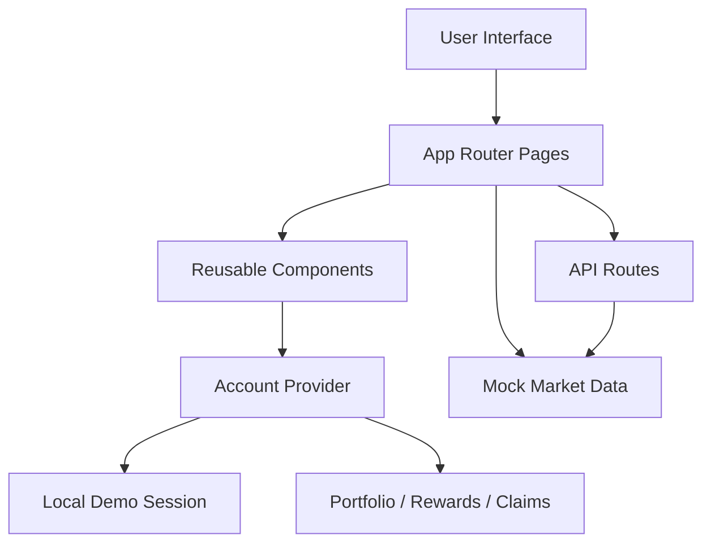
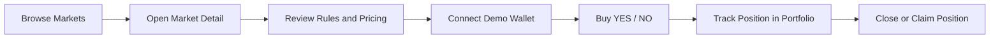

<p align="center">
  
</p>

<h1 align="center">FORE MVP</h1>

<p align="center">
  ForeSeen Protocol (<strong>FORE</strong>) is a Solana-native prediction market MVP focused on the smallest credible product loop for market discovery, trading, portfolio tracking, and settlement simulation.
</p>

<p align="center">
  
  
  
  
  
</p>

<p align="center">
  <a href="https://www.fore.lat">Website</a> |
  <a href="https://x.com/foreprotocol">X / Twitter</a>
</p>

<p align="center">
  <a href="#overview">Overview</a> |
  <a href="#official-links">Official Links</a> |
  <a href="#project-highlights">Highlights</a> |
  <a href="#technical-architecture">Architecture</a> |
  <a href="#feature-modules">Modules</a> |
  <a href="#project-status">Status</a> |
  <a href="#installation">Installation</a> |
  <a href="#roadmap">Roadmap</a> |
  <a href="#faq">FAQ</a> |
  <a href="#repository-documents">Documents</a>
</p>

---

## Overview

This repository contains a GitHub-ready MVP scaffold for a prediction market product built around a clear first-principles flow:

1. A user discovers a market.
2. The user evaluates the resolution rules and pricing.
3. The user connects a wallet and buys a YES or NO position.
4. The position appears in portfolio and can be managed or closed.
5. A resolved market can be claimed through the same product loop.

The current implementation is intentionally front-end first. It provides a realistic product demo using local mock state, mock API routes, and a complete user-facing experience, without yet requiring live on-chain infrastructure.

## Official Links

- **Website:** [https://www.fore.lat](https://www.fore.lat)
- **X / Twitter:** [https://x.com/foreprotocol](https://x.com/foreprotocol)

## Repository Documents

- [`README.md`](./README.md): project overview, architecture, roadmap, and usage
- [`CHANGELOG.md`](./CHANGELOG.md): notable repository changes
- [`CONTRIBUTING.md`](./CONTRIBUTING.md): contribution expectations and workflow
- [`SECURITY.md`](./SECURITY.md): security reporting and current MVP limitations
- [`LICENSE`](./LICENSE): MIT license for the repository

## Project Highlights

- Cold-white, premium product UI designed for a launch-style prediction market experience
- Market discovery with search, category filters, and status filters
- Market detail pages with explicit resolution rules and trade decision support
- Demo wallet connection state for MVP interaction flow
- Local account persistence for trades, positions, rewards, and claims
- Portfolio management with close and claim actions
- Rules, help, rewards, and market creation pages to support trust and product framing
- Mock API routes for markets and account session data

## Why this MVP exists

FORE MVP is designed to answer one practical question:

> Can the product communicate trust, usability, and core market mechanics before the full protocol stack is live?

This repository focuses on that answer by shipping the minimum product surface necessary to demo:

- market readability
- resolution clarity
- basic trading interaction
- wallet-aware state
- post-trade portfolio behavior

## Technical Architecture

### Stack

- **Framework:** Next.js 15 (App Router)
- **Language:** TypeScript
- **UI:** React 19 with custom CSS
- **State Management:** React context with localStorage persistence
- **API Layer:** Next.js route handlers
- **Runtime Model:** Front-end MVP with mock trading and mock wallet state

### Architecture Summary



### Core Data Layers

- `lib/mock-data.ts`
  Holds market inventory, featured markets, and initial demo session data.

- `lib/types.ts`
  Defines the market, position, wallet, and account models used across the app.

- `components/account-provider.tsx`
  Acts as the central demo-session engine for:
  - wallet connection state
  - buying positions
  - closing positions
  - claiming winnings
  - resetting the demo account

## Feature Modules

### 1. Homepage

**File:** `app/page.tsx`

Purpose:
- establish product positioning
- frame the launch story
- surface featured markets
- explain token utility
- direct users into the trading flow

### 2. Market Discovery

**Files:** `app/markets/page.tsx`, `components/markets-browser.tsx`, `components/market-card.tsx`

Purpose:
- browse available markets
- search by keyword
- filter by category
- filter by status
- enter a market decision page quickly

### 3. Market Detail and Trading

**Files:** `app/market/[slug]/page.tsx`, `components/trade-panel.tsx`

Purpose:
- display market pricing
- show implied probability
- explain official resolution rules
- support trade sizing
- support close and claim actions for existing positions

### 4. Portfolio

**File:** `app/portfolio/page.tsx`

Purpose:
- show current balances
- display open positions
- surface claimable winnings
- display recent activity
- let the user reset or reconnect the demo session

### 5. Rewards and Token Utility

**File:** `app/rewards/page.tsx`

Purpose:
- explain FORE utility
- show reward framing
- anchor token utility to product rights rather than hype

### 6. Rules and Help

**Files:** `app/rules/page.tsx`, `app/help/page.tsx`

Purpose:
- explain resolution logic
- define invalid-market behavior
- answer launch-day user questions

### 7. Market Proposal Flow

**File:** `app/create/page.tsx`

Purpose:
- represent the moderated market submission path
- show how market intake can work before permissionless creation

### 8. Mock APIs

**Files:** `app/api/markets/route.ts`, `app/api/account/route.ts`

Purpose:
- expose JSON data for external demo use
- simulate integration points for future backend replacement

## Product Flow



## Repository Structure

```text
.
|-- app/
|   |-- api/
|   |-- create/
|   |-- help/
|   |-- market/[slug]/
|   |-- markets/
|   |-- portfolio/
|   |-- rewards/
|   |-- rules/
|   |-- globals.css
|   |-- layout.tsx
|   `-- page.tsx
|-- components/
|   |-- account-provider.tsx
|   |-- market-card.tsx
|   |-- markets-browser.tsx
|   |-- site-footer.tsx
|   |-- site-header.tsx
|   `-- trade-panel.tsx
|-- lib/
|   |-- mock-data.ts
|   |-- types.ts
|   `-- utils.ts
|-- public/
|   `-- fore-logo.png
|-- .env.example
|-- package.json
|-- tsconfig.json
`-- README.md
```

## Project Status

### Current Stage

This repository is currently in **MVP / demo-ready** stage.

### Completed

- Homepage and product framing
- Searchable and filterable market discovery
- Market detail pages with rules and pricing
- Demo wallet connection flow
- Buy, close, and claim interactions
- Portfolio and recent activity tracking
- Rewards, rules, help, and create pages
- Mock API routes
- Production build verification

### Not Yet Implemented

- Live Solana wallet adapter integration
- On-chain market creation and settlement
- Real backend persistence
- Authentication and user accounts
- Admin resolution console
- Real-time order book or maker engine
- Live oracle integration

## Project Features

### Product Features

- Binary market presentation
- YES / NO pricing
- Rule-first decision pages
- Portfolio management
- Claimable settlement simulation
- Token utility framing for FORE

### Engineering Features

- Type-safe domain models
- Shared state through a single provider
- Route-based page architecture
- Mock data and UI separated cleanly
- JSON endpoints ready for replacement by real services

## Installation

### Requirements

- Node.js 20 or newer recommended
- npm 10 or newer recommended

### Install dependencies

```bash
npm install
```

## Configuration

Create a local environment file if needed:

```bash
cp .env.example .env.local
```

### Available variables

- `NEXT_PUBLIC_SITE_URL`
  Base application URL for local or deployed environments

- `NEXT_PUBLIC_SOLANA_NETWORK`
  Intended Solana environment such as `devnet`

- `NEXT_PUBLIC_PROTOCOL_NAME`
  Public-facing protocol label

## Usage

### Start the development server

```bash
npm run dev
```

Open:

```text
http://localhost:3000
```

### Build for production

```bash
npm run build
```

### Start the production server

```bash
npm run start
```

## API Endpoints

### `GET /api/markets`

Returns the mock market inventory used by the UI.

### `GET /api/account`

Returns the demo session object containing:

- wallet connection state
- balances
- positions
- activity

## Design Principles

The MVP follows these principles:

- **Trust before scale**
  Resolution clarity matters more than visual complexity.

- **One clear loop**
  The product should make the market lifecycle easy to understand.

- **Mock now, replace later**
  Demo-safe infrastructure should be easy to swap with live integrations.

- **Token utility should feel earned**
  FORE is framed as access, incentives, and governance rather than empty speculation.

## Roadmap

### April 2026

- complete front-end MVP
- complete demo trading flow
- prepare the repository for GitHub publication
- align brand assets, website, and launch documentation

### May 2026

- add Solana wallet adapter integration
- replace mock wallet state with a real wallet session
- connect market data to live or managed data sources

### June 2026

- add backend persistence for account and market actions
- introduce admin and resolution tooling
- define settlement and invalid-market services

### July 2026 and beyond

- integrate protocol settlement logic
- expand monitoring, analytics, and security hardening
- move from MVP demo flow toward production readiness

## FAQ

### Is this already connected to Solana?

Not yet. This repository is a front-end MVP with demo session state and mock routes. It is designed to be the base layer for future Solana integration.

### Are the trades real?

No. Trades in the current MVP are simulated locally and persisted in browser storage.

### Why is USDC used as the trading asset in the product design?

USDC is easier for users to understand as the quote asset. FORE is better positioned as the utility, rewards, governance, and status token.

### Why include rules and help pages this early?

Prediction markets depend on trust. Resolution clarity and invalid-market logic are core product features, not documentation afterthoughts.

### Can this repository be uploaded to GitHub now?

Yes. The project is structured as a GitHub-ready MVP repository and has already passed a production build check.

### Where can users follow the project?

Users can follow the project on X at [@foreprotocol](https://x.com/foreprotocol) and visit the website at [www.fore.lat](https://www.fore.lat).

## Known Limitations

- No live wallet integration
- No live data refresh
- No backend database
- No authentication system
- No production-grade trading engine
- Current dependency set should be reviewed before public deployment

## Next Recommended Engineering Steps

- integrate `@solana/wallet-adapter`
- add server-side persistence for account and market actions
- define settlement and invalid-market services
- add market admin tools
- introduce analytics and error monitoring
- upgrade and harden dependencies before production launch

## License

This repository is licensed under the [MIT License](./LICENSE).
